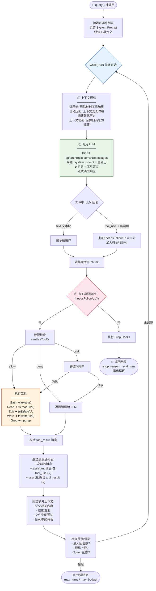
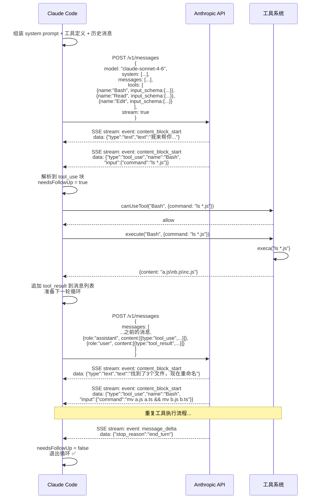
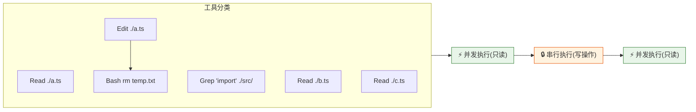
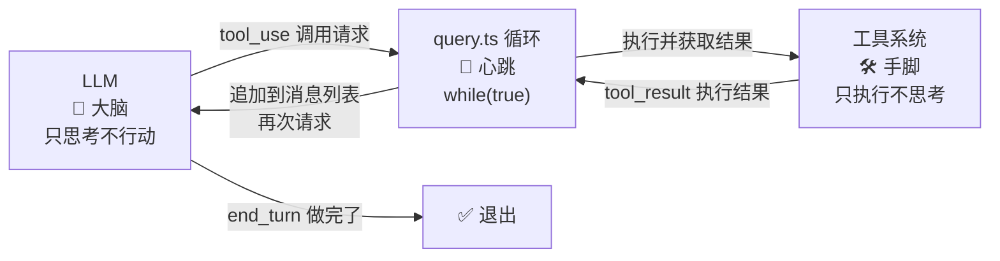

# Claude Code 核心机制图解

## 1. 整体架构：大脑、神经、手脚

```mermaid
graph TB
    subgraph 大脑["🧠 LLM (Claude API)"]
        direction LR
        Think["思考 + 决策<br/>只输出文字或工具调用请求<br/>不接触文件系统"]
    end

    subgraph 手脚["🛠️ 工具系统"]
        direction LR
        Bash["Bash<br/>执行命令"]
        Read["Read<br/>读文件"]
        Edit["Edit<br/>编辑文件"]
        Write["Write<br/>写文件"]
        Grep["Grep<br/>搜索内容"]
        Glob["Glob<br/>匹配文件"]
    end

    subgraph 神经["🔁 QueryEngine + query.ts"]
        Loop["while(true) 循环<br/>──心跳──"]
        State["消息历史管理<br/>──记忆──"]
        Permission["权限检查<br/>──免疫系统──"]
    end

    User["👤 用户"] -->|输入消息| State
    State -->|组装消息+工具定义| Loop
    Loop -->|POST /v1/messages<br/>system prompt + 历史 + 工具列表| Think
    Think -->|流式响应<br/>text ➜ 展示<br/>tool_use ➜ 行动| Loop
    Loop -->|检查权限后执行| 手脚
    手脚 -->|执行结果 tool_result| Loop
    Loop -->|追加到消息列表| State
    State -->|下一轮循环| Loop
    Loop -->|stop_reason=end_turn<br/>"我做完了"| User

    style 大脑 fill:#e8f5e9,stroke:#2e7d32
    style 手脚 fill:#fff3e0,stroke:#e65100
    style 神经 fill:#e3f2fd,stroke:#1565c0
```

---

## 2. query.ts 的 while(true) 死循环



---

## 3. LLM 请求/响应格式



---

## 4. 工具并发/串行编排



---

## 5. 完整回合示例

```mermaid
sequenceDiagram
    actor User
    participant QE as QueryEngine
    participant Query as query.ts 循环
    participant LLM as Claude API
    participant Tools as 工具系统
    participant FS as 文件系统

    User->>QE: "把所有 .js 改成 .ts"

    QE->>QE: 组装 System Prompt<br/>+ 工具列表 + 环境信息
    QE->>QE: processUserInput()<br/>处理用户输入

    QE->>Query: query(messages, systemPrompt, tools)

    rect rgb(232, 245, 233)
        Note over Query,FS: 回合 1 — 探索
        Query->>LLM: 消息: "把所有 .js 改成 .ts"<br/>工具: Bash/Read/Edit/Write...
        LLM-->>Query: text: "我先看看有哪些 js 文件"
        LLM-->>Query: tool_use: Bash("find . -name '*.js'")
        Query->>Tools: 执行 Bash
        Tools->>FS: find . -name '*.js'
        FS-->>Tools: a.js\nb.js\nc.js
        Tools-->>Query: tool_result
    end

    rect rgb(255, 243, 224)
        Note over Query,FS: 回合 2 — 行动
        Query->>LLM: 消息: [...历史 + tool_use + tool_result]
        LLM-->>Query: tool_use: Bash("for f in *.js; do mv $f ${f%.js}.ts; done")
        Query->>Tools: 权限检查 → ask
        Tools-->>User: 弹窗: "允许执行 mv 命令?"
        User-->>Tools: 确认
        Tools->>FS: 批量 mv 重命名
        FS-->>Tools: 成功
        Tools-->>Query: tool_result
    end

    rect rgb(227, 242, 253)
        Note over Query,FS: 回合 3 — 结束
        Query->>LLM: 消息: [...历史 + tool_use + tool_result]
        LLM-->>Query: text: "完成，3个文件已重命名"
        LLM-->>Query: stop_reason: "end_turn"
        Query->>Query: needsFollowUp = false<br/>退出循环
    end

    Query-->>QE: 最终结果
    QE-->>User: ✅ "完成，3个文件已重命名"
```

---

## 6. 一句话总结



**LLM 是大脑（只思考不行动），工具是手脚（只执行不思考），QueryEngine 是神经系统（在两者间传递信息），query.ts 里的 `while(true)` 就是心跳。**
