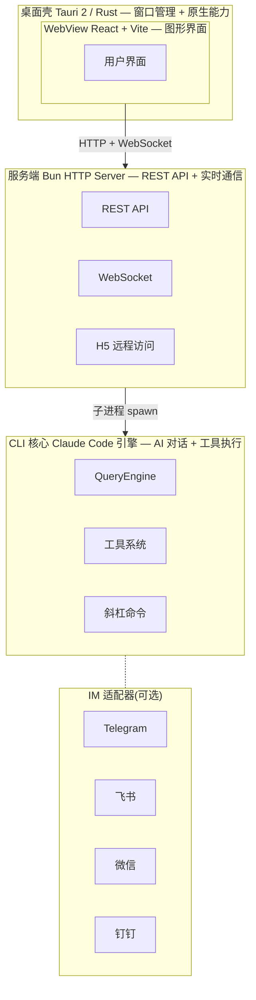
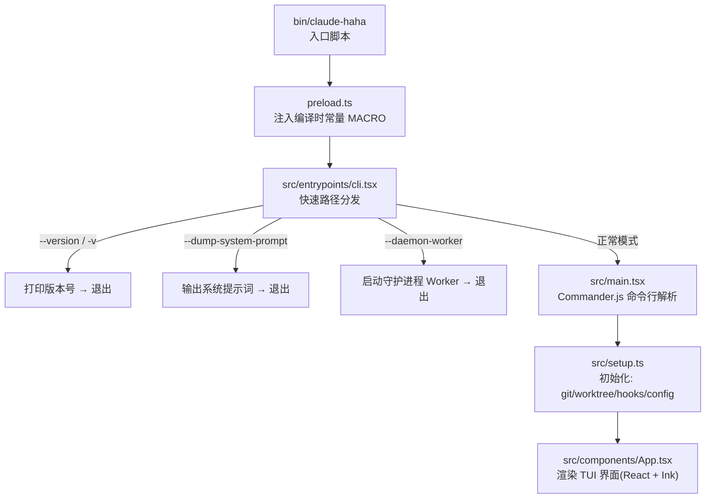
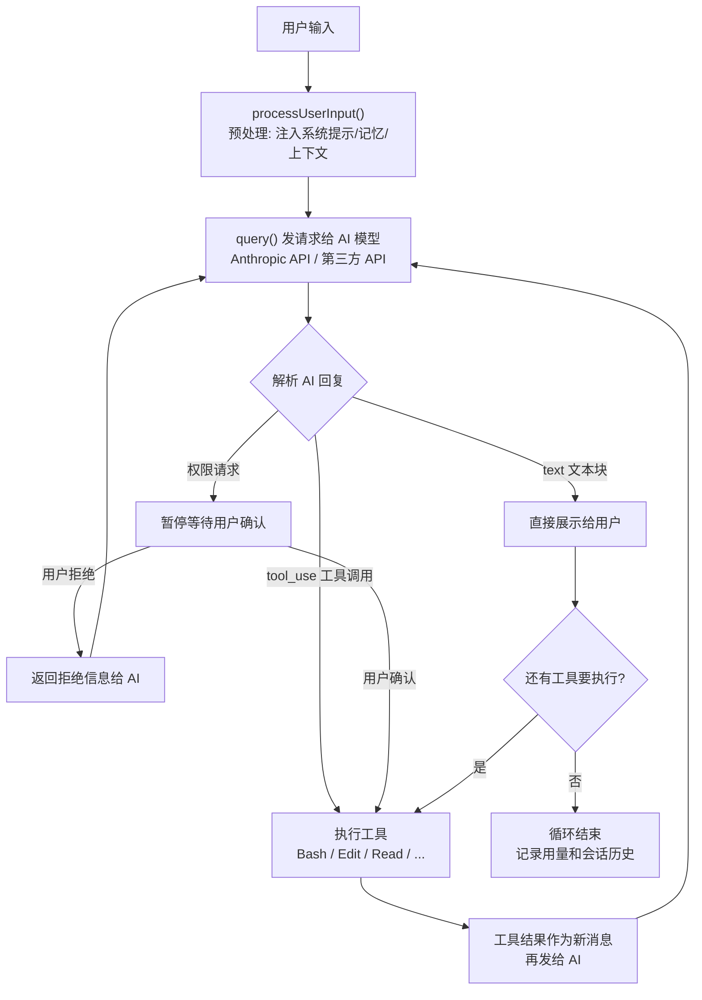
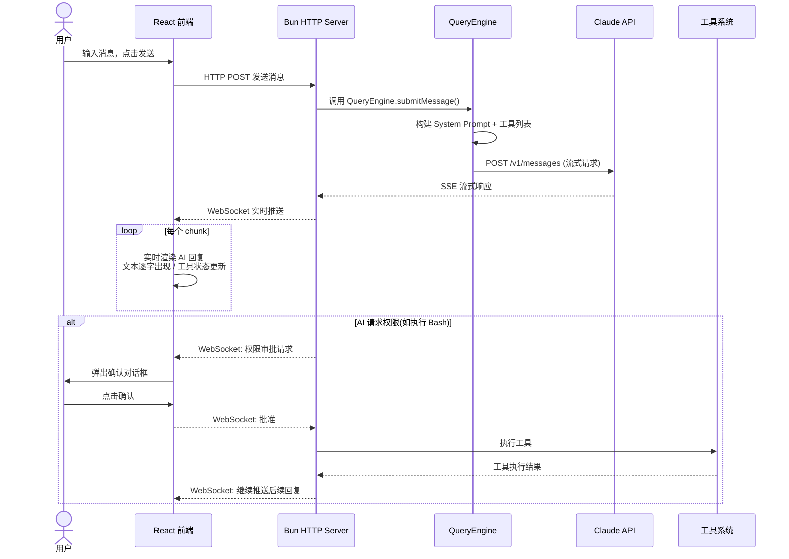
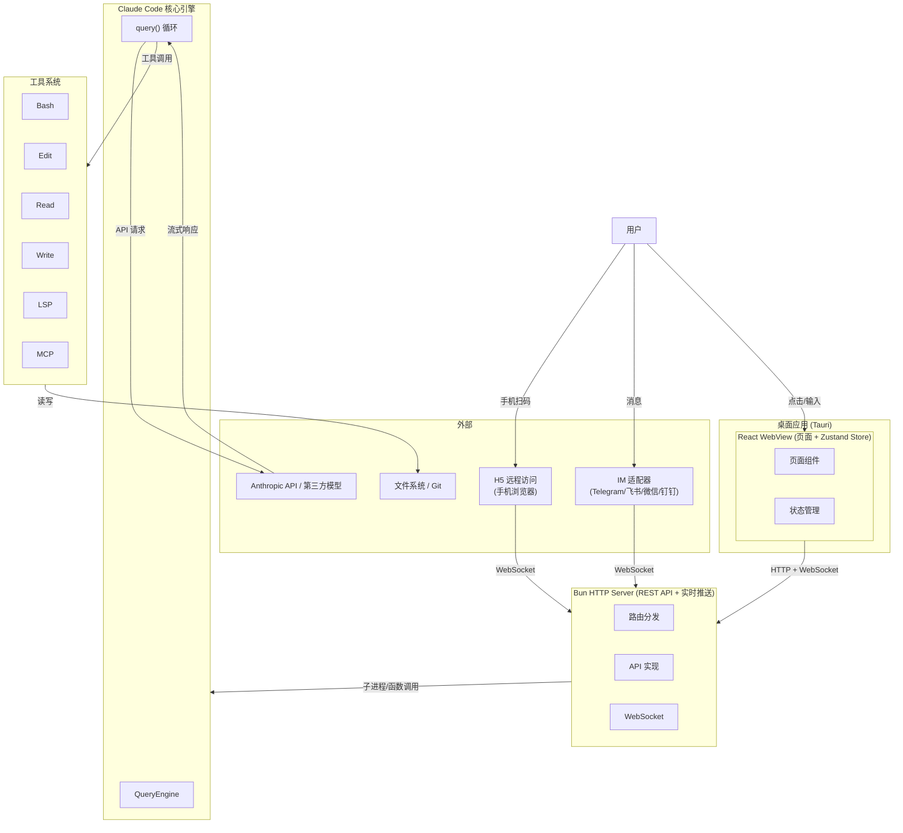

# Claude Code Haha 源码学习指南

> 一份通熟易懂的仓库实现文档，帮助你快速理解这个项目的架构和核心代码。

---

## 一、项目是什么？

Claude Code Haha 是一个**桌面端 Claude Code 工作台**。简单说，就是把原本只能在终端里用的 Claude Code（AI 编程助手），包装成了一个带图形界面的桌面应用，支持 macOS 和 Windows。

它的核心能力可以概括为：

- **在桌面 APP 里和 AI 对话写代码**（不用一直盯着终端）
- **同时管理多个项目**（标签页切换，每个项目独立会话）
- **可视化查看代码改动**（右侧面板实时显示 AI 改了什么文件、Diff 对比）
- **权限审批流**（AI 要执行危险命令时，弹窗让你确认）
- **多模型支持**（不仅支持 Anthropic 官方模型，还能接入 OpenAI、DeepSeek、Ollama 等）
- **远程访问**（手机扫码就能接入桌面端的会话）
- **IM 接入**（通过 Telegram / 飞书 / 微信 / 钉钉远程操作）
- **定时任务**（设置定时执行的 AI 任务）

**关键背景**：这个项目基于 2026 年 3 月 31 日从 Anthropic npm registry 泄露的 Claude Code 源码修复而来。

---

## 二、整体架构：三层结构

从宏观上看，整个项目是一个**三层架构**：



### 第一层：Tauri 桌面壳 (`desktop/src-tauri/`)

Tauri 是一个用 Rust 写的跨平台桌面框架，类似 Electron 但更轻量。这层负责：

- **窗口管理**：创建和管桌面窗口，设置大小、标题
- **Sidecar 进程编排**：Tauri 可以启动和管理子进程（叫 Sidecar），这里它启动了服务端和 IM 适配器
- **原生 API 桥接**：比如原生对话框、自动更新等

核心文件是 `desktop/src-tauri/src/lib.rs`。

### 第二层：服务端 (`src/server/`)

这是一个用 Bun 内置 HTTP 服务器实现的中间层，提供：

- **REST API**：给前端 React 页面提供数据（会话列表、配置管理、Token 用量等）
- **WebSocket**：实时推送 AI 对话内容、代码改动状态等
- **H5 远程访问**：生成一次性令牌，让手机浏览器可以接入桌面端会话

默认监听 `127.0.0.1:3456`。

### 第三层：CLI 核心 (`src/`)

这是项目的核心——Claude Code 的 AI 编程引擎。它原本是 Anthropic 的 CLI 工具源码，负责：

- **AI 对话循环**：接收用户输入 → 发给 AI 模型 → 解析回复 → 执行工具调用 → 返回结果 → 循环
- **工具系统**：Bash 命令执行、文件读写编辑、Git 操作、MCP 等
- **斜杠命令**：`/commit`、`/review`、`/diff` 等
- **终端 UI**：基于 Ink（React 终端渲染框架）的交互界面

---

## 三、CLI 核心详解

### 3.1 启动流程

整个启动过程：



**关键文件说明**：

| 文件 | 大小 | 职责 |
|------|------|------|
| `bin/claude-haha` | 小 | 入口脚本，启动 Bun 运行时 |
| `preload.ts` | 小 | Bun preload，注入 `MACRO.VERSION` 等编译时常量 |
| `src/entrypoints/cli.tsx` | ~200 行 | 快速路径分发：`--version`、`--dump-system-prompt`、`--daemon-worker` 等特殊模式直接处理并退出，正常模式加载 `main.tsx` |
| `src/main.tsx` | ~4750 行 | **核心启动文件**：Commander.js 解析 CLI 参数、初始化配置、加载工具/命令/技能、启动 REPL 界面 |
| `src/setup.ts` | ~600 行 | 会话初始化：定位 git 仓库根目录、配置 worktree、加载 hooks、项目配置等 |

### 3.2 核心循环：QueryEngine

`src/QueryEngine.ts`（~1366 行）是 AI 对话的引擎，负责整个"用户提问 → AI 回答 → 工具执行"的循环。

它的主要工作流程：



**核心相关文件**：

| 文件 | 职责 |
|------|------|
| `src/query.ts` | 实际的 API 调用层：构建请求、发送给模型、处理流式响应、自动压缩上下文 |
| `src/QueryEngine.ts` | 对话状态机：管理消息历史、处理工具调用结果、处理权限、触发记忆保存 |

### 3.3 工具系统

工具是 AI 与外部世界交互的方式。AI 模型不能直接修改文件或执行命令，它只能"请求"执行某个工具，由工具系统来实际执行。

工具的定义在 `src/Tool.ts`，核心接口：

```typescript
interface Tool {
  name: string;                    // 工具名，如 "Bash"、"Read"、"Edit"
  description: string;             // 给 AI 看的描述
  inputSchema: JSONSchema;         // 参数定义（JSON Schema）
  prompt?: (context) => string;    // 可选：注入到系统提示的内容
  tool: (context, input) => Promise<ToolResult>;  // 实际执行函数
}
```

**工具目录** `src/tools/` 包含约 40+ 个工具，分几大类：

**文件操作类**：
- `BashTool/` — 执行 Shell 命令
- `FileReadTool/` — 读取文件
- `FileEditTool/` — 精确编辑文件（字符串替换）
- `FileWriteTool/` — 写入文件
- `GlobTool/` — 文件模式匹配搜索
- `GrepTool/` — 文件内容搜索
- `NotebookEditTool/` — 编辑 Jupyter Notebook
- `LSPTool/` — 语言服务器协议（代码智能提示）

**交互类**：
- `AskUserQuestionTool/` — 向用户提问
- `TaskCreateTool/` — 创建任务列表

**Agent 类**：
- `AgentTool/` — 启动子 Agent 执行子任务
- `SendMessageTool/` — 向其他 Agent 发送消息

**工作区类**：
- `EnterPlanModeTool/` — 进入计划模式
- `EnterWorktreeTool/` — 进入 git worktree 隔离环境
- `ExitPlanModeTool/` — 退出计划模式

**外部集成类**：
- `MCPTool/` — 执行 MCP（Model Context Protocol）工具
- `SkillTool/` — 调用技能

### 3.4 斜杠命令系统

斜杠命令是用户在对话中输入 `/xxx` 形式的快捷操作。定义在 `src/commands/`（约 96 个子目录/文件）。

`src/commands.ts` 负责注册和分发命令。命令系统支持：
- **用户命令**：`/commit`、`/review`、`/diff`、`/branch`、`/pr` 等
- **配置命令**：`/config`、`/model`、`/effort` 等
- **Agent 命令**：`/agents`、`/buddy` 等
- **工具命令**：`/doctor`、`/compact`、`/export` 等

每个命令是一个遵循特定接口的模块，包含名称、描述、参数和执行逻辑。

### 3.5 终端 UI：Ink 渲染

整个命令行界面是用 **Ink** 渲染的——Ink 是一个用 React 写终端 UI 的库。这意味着你看到的终端界面实际上是 React 组件树。

关键文件：
- `src/components/App.tsx` — 终端 UI 的根组件
- `src/screens/REPL.tsx` — 交互式 REPL 界面（主聊天界面）
- `src/ink/` — Ink 渲染引擎的适配层
- `src/components/` — 各种 UI 组件（约 34 个子目录）

---

## 四、服务端详解

服务端（`src/server/`）是用 Bun 内置的 `Bun.serve` 实现的 HTTP + WebSocket 服务器。

### 4.1 启动和路由

```
src/server/index.ts (入口)
  → src/server/server.ts (服务器配置，启动 Bun.serve)
  → src/server/router.ts (路由分发，131 行)
  → src/server/api/ (各种 API 实现)
  → src/server/ws/handler.ts (WebSocket 处理，2110 行)
```

**HTTP API 模块**（`src/server/api/`）：

| API | 功能 |
|-----|------|
| `sessions.ts` | 会话管理（列表、创建、切换、删除） |
| `chat.ts` | 聊天消息收发 |
| `providers.ts` | 模型提供商配置 |
| `settings.ts` | 设置读写 |
| `workspace.ts` | 工作区文件状态 |
| `tasks.ts` | 定时任务管理 |
| `diagnostics.ts` | 诊断信息 |
| `oaut.ts` | OAuth 认证 |

**WebSocket**（`src/server/ws/handler.ts`，2110 行）负责实时双向通信：
- AI 对话内容实时推送到前端
- 文件改动状态实时同步
- 权限确认弹窗
- CLI 输出流转发

### 4.2 H5 远程访问

用户可以在桌面端生成一个二维码，手机扫码后通过浏览器接入。实现流程：

1. 生成一次性令牌（OTP）
2. 手机浏览器访问 `http://<ip>:<port>/h5?token=xxx`
3. 服务端验证令牌，建立 WebSocket 连接
4. 手机端看到和桌面端一致的会话界面

---

## 五、桌面端详解

桌面端（`desktop/`）是一个独立的 React + Vite 前端项目，被 Tauri 的 WebView 加载。

### 5.1 目录结构

```
desktop/
├── src/
│   ├── App.tsx              # 根组件
│   ├── main.tsx             # React 入口
│   ├── api/                 # 与后端通信的 API 客户端
│   ├── components/          # 共享 UI 组件
│   │   └── layout/          # 布局组件（AppShell 等）
│   ├── hooks/               # React Hooks
│   ├── i18n/                # 国际化
│   ├── lib/                 # 工具函数
│   ├── pages/               # 页面组件（每个标签页/视图）
│   ├── stores/              # Zustand 状态管理（20+ 个 store）
│   └── types/               # TypeScript 类型
├── src-tauri/               # Tauri Rust 代码
│   ├── src/lib.rs           # Tauri 主逻辑
│   ├── tauri.conf.json      # Tauri 配置
│   └── Cargo.toml           # Rust 依赖
└── package.json             # 前端依赖
```

### 5.2 状态管理：Zustand Stores

桌面端用 Zustand 管理所有状态，主要包括：

| Store | 职责 |
|-------|------|
| `chatStore` | 聊天消息、对话历史、发送消息（2668 行，最复杂） |
| `settingsStore` | 桌面端设置（模型、提供器、UI 偏好等） |
| `workspacePanelStore` | 工作区面板状态（文件改动、Diff 视图） |
| `sessionStore` | 会话列表和管理 |
| `tabStore` | 标签页管理（多项目/多会话切换） |
| `providerStore` | 模型提供商配置 |
| `taskStore` | 定时任务管理 |
| `mcpStore` | MCP 服务器配置 |
| `memoryStore` | 记忆系统设置 |
| `teamStore` | 团队/Agent Teams 管理 |
| `adapterStore` | IM 适配器管理 |
| `updateStore` | 自动更新状态 |
| `uiStore` | UI 状态（主题、侧边栏等） |

### 5.3 页面组件

`desktop/src/pages/` 包含各个主要页面：

| 页面 | 说明 |
|------|------|
| `ActiveSession.tsx` | 活跃会话界面（主聊天界面） |
| `EmptySession.tsx` | 空会话/新建会话界面 |
| `SessionControls.tsx` | 会话控制面板 |
| `Settings.tsx` | 设置页面 |
| `ActivitySettings.tsx` | 活动设置 |
| `ScheduledTasks.tsx` | 定时任务页面 |
| `McpSettings.tsx` | MCP 配置页面 |
| `ComputerUseSettings.tsx` | Computer Use（桌面控制）配置 |
| `AdapterSettings.tsx` | IM 适配器配置 |
| `TerminalSettings.tsx` | 终端配置 |
| `AgentTeams.tsx` | Agent 团队管理 |
| `ToolInspection.tsx` | 工具检查面板 |

### 5.4 三层通信流程

一个典型的用户操作（比如发送一条消息）经过的完整路径：



---

## 六、其他重要系统

### 6.1 技能系统 (`src/skills/`)

技能是可扩展的能力插件，类似于给 AI 添加"专业技能"。每个技能定义了自己在什么条件下激活、提供什么样的系统提示、注册什么工具。

技能可以来自：
- **内置技能** (`src/skills/bundled/`)
- **用户自定义技能** (`~/.claude/skills/`)
- **项目级技能** (`.claude/skills/`)

### 6.2 IM 适配器 (`adapters/`)

让用户通过即时通讯工具远程与 Claude Code 交互。每个适配器是一个独立的 Sidecar 进程：

```
adapters/
├── telegram/     # Telegram Bot 适配器
├── feishu/       # 飞书适配器
├── wechat/       # 微信适配器
├── dingtalk/     # 钉钉适配器
└── common/       # 共享工具
```

适配器通过 `adapters/package.json` 和各自目录下的脚本运行，连接到服务端的 WebSocket。

### 6.3 MCP 集成 (`src/services/mcp/`)

MCP（Model Context Protocol）允许 AI 连接外部工具和数据源。项目完整实现了 MCP 客户端：

- 支持 stdio 和 HTTP 两种传输方式
- 支持 OAuth 认证
- 自动发现和注册 MCP 服务器的工具
- 用户可以在桌面端 UI 配置 MCP 服务器

### 6.4 记忆系统 (`src/memdir/`)

跨会话持久化记忆。AI 在对话中学到的信息（用户偏好、项目约定等）会被自动提取并保存，下次会话时作为系统提示的一部分注入。

### 6.5 计划模式

当用户请求复杂任务时，AI 会先进入"计划模式"：
1. AI 分析当前代码库
2. 生成实施计划（不需要实际执行）
3. 展示计划给用户确认
4. 用户确认后才开始实际编码

相关文件：
- `src/tools/EnterPlanModeTool/`
- `src/tools/ExitPlanModeTool/`
- `src/tools/AskUserQuestionTool/`

---

## 七、目录结构速查表

```
cc-haha/
├── bin/claude-haha           # 入口脚本（可执行文件）
├── preload.ts                # Bun preload
├── package.json              # 根项目配置（依赖、脚本）
├── src/                      # CLI 核心 + 服务端
│   ├── entrypoints/cli.tsx   # CLI 入口
│   ├── main.tsx              # 主启动逻辑（~4750 行）
│   ├── setup.ts              # 会话初始化
│   ├── QueryEngine.ts        # AI 对话引擎（~1366 行）
│   ├── query.ts              # API 调用层（~1730 行）
│   ├── Tool.ts               # 工具基类定义
│   ├── commands.ts           # 命令系统入口
│   ├── tools.ts              # 工具注册入口
│   ├── tools/                # 工具实现（~60 个子目录）
│   ├── commands/             # 斜杠命令实现（~96 个）
│   ├── components/           # Ink 终端 UI 组件
│   ├── server/               # HTTP + WebSocket 服务
│   ├── services/             # 服务层（API、MCP、OAuth 等）
│   ├── skills/               # 技能系统
│   ├── utils/                # 工具函数（~34 个模块）
│   ├── hooks/                # React Hooks
│   ├── state/                # 状态管理
│   └── types/                # TypeScript 类型定义
├── desktop/                  # 桌面应用
│   ├── src/                  # React 前端
│   │   ├── App.tsx           # 根组件
│   │   ├── api/              # API 客户端
│   │   ├── components/       # UI 组件
│   │   ├── pages/            # 页面组件
│   │   ├── stores/           # Zustand 状态管理
│   │   ├── hooks/            # React Hooks
│   │   └── i18n/             # 国际化
│   └── src-tauri/            # Tauri Rust 代码
├── adapters/                 # IM 适配器
│   ├── telegram/             # Telegram
│   ├── feishu/               # 飞书
│   ├── wechat/               # 微信
│   └── dingtalk/             # 钉钉
├── docs/                     # VitePress 文档
├── scripts/                  # 构建/测试/发布脚本
├── fixtures/                 # 测试数据
└── tests/                    # 测试
```

---

## 八、技术栈一览

| 类别 | 技术 | 用途 |
|------|------|------|
| 运行语言 | TypeScript | 全项目 |
| 运行时 | [Bun](https://bun.sh) | JavaScript/TypeScript 运行时 + 包管理 |
| CLI 框架 | Commander.js | 命令行参数解析 |
| 终端 UI | React + [Ink](https://github.com/vadimdemedes/ink) | 终端界面渲染 |
| 桌面框架 | [Tauri](https://github.com/tauri-apps/tauri) 2 | 跨平台桌面壳（Rust） |
| 桌面 UI | React + Vite + Tailwind CSS | 图形界面 |
| 状态管理 | Zustand | 桌面端状态管理 |
| AI SDK | `@anthropic-ai/sdk` | 调用 Claude API |
| 协议 | MCP（Model Context Protocol） | 外部工具集成 |
| 协议 | LSP（Language Server Protocol） | 代码智能 |
| 文档 | VitePress | 文档站点 |
| 测试 | Vitest + Bun Test | 单元测试 |

---

## 九、数据流全景图



---

## 十、从哪开始读代码？

建议按以下顺序阅读源码：

1. **`bin/claude-haha`** — 看入口脚本做了什么（很短，几十行）
2. **`src/entrypoints/cli.tsx`** — 理解快速路径分发逻辑
3. **`src/main.tsx`** — 核心启动文件，但太长（4750 行），建议先看前 200 行了解 Commander.js 的命令定义和初始化流程，然后跳到 `launchRepl` 那部分
4. **`src/screens/REPL.tsx`** — REPL 界面，理解终端 UI 的结构
5. **`src/QueryEngine.ts`** — AI 对话循环的核心
6. **`src/query.ts`** — API 调用层，理解消息如何发送给 AI 模型
7. **`src/Tool.ts`** — 理解工具接口，然后挑一个简单工具看（如 `FileReadTool`）
8. **`src/server/index.ts` + `src/server/router.ts`** — 理解服务端架构
9. **`desktop/src/App.tsx` + `desktop/src/stores/chatStore.ts`** — 理解桌面端核心
10. **`desktop/src-tauri/src/lib.rs`** — 理解 Tauri 层
